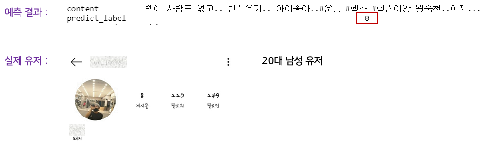

# InstaGram Profile Prediction

#### 인스타그램의 텍스트 분석을 통한 사용자 프로필 예측

> [관련 논문] : Project_Reference/Twitter user profiling based on text and community mining for market analysis.pdf
>
> [관련 논문] : Project_Reference/Finding community structure in very large networks.pdf

#### 활용 패키지

> `soynlp`, `KoBERT`, `Scrapy`

#### 활용 데이터(Data Crawling)

> 1. 인스타그램 사용자 정보
>    - 인스타그램 내부 ID, 인스타그램 사용자명, 사용자 프로필, 팔로워 수, 팔로잉 수
> 2. 인스타그램 사용자 포스트
>    - 인스타그램 사용자명, 포스트 ID, 포스트 내용, 해시태그, 장소 태그

#### 데이터 전처리(Data Preprocessing)

> 1. 해시태그 기반 데이터 라벨링
>    - ex) 미성년자 - `#10대`, `#초1`, `#초딩스타그램` 등
> 2. '`\t`', '`\n`' 등과 같은 무의미한 단어 제거
> 3. 음절 수 5개 이하 문장 제거
> 4. `soynlp` 패키지를 이용해 토큰화
>    * 관련 자료 : https://github.com/lovit/soynlp

#### 데이터 분석(Data Analysis)

> 1.  텍스트 기반(Text Based)
>    - 라벨링 별로 `Characteristic Term` 추출
>    - `SVM`을 이용해 정답 확률 계산
> 2.  커뮤니티 기반(Community Based)
>    - 정보가 알려진 타겟 유저를 중심으로 군집 형성
>    - 타겟 유저와의 팔로워, 팔로잉 관계의 유저 군집에 추가(군집 당 최대 700명)
>    - 군집 내 유저들의 정보를 텍스트 기반으로 예측
> 3. 딥 러닝 기반 텍스트 분석(Deep Learning Based)
>    - `KoBERT`를 이용한 텍스트 기반 분류
>    - 관련 자료 :  https://github.com/SKTBrain/KoBERT

#### 예측 결과

> 
>
> 1에폭 기준 : Train 정확도 `71.71%`, Test 정확도 `77.04%`